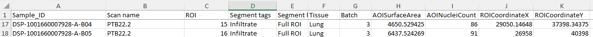

# TREM2 macrophages in PTB
This repo contains the code used to process our GeoMx and CosMx data and generate plots for the manuscript. Plots and data are not included here. 

## GeoMx
Like bulk RNA-seq but with coordinates. We take the data and filter out spots that do not have enough genes expressed and genes that are not expressed above background (see NanoString document on limit of quantification). There are some other filters too related to the NGS read alignment and nuclei count. We start with the DCC files, an annotation file, and a configuration file. 

The annotation file has DCC filenames (**Sample_ID**) + tissue labels (**Scan name**) + sample annotations (**Segment tags**) + coordinates. It was constructed from the SegmentProperties sheet within the NanoString counts spreadsheets provided over the initial data dump for each sample. 

* Filtering and quality control: [NanoString workflow](https://www.bioconductor.org/packages/release/workflows/vignettes/GeoMxWorkflows/inst/doc/GeomxTools_RNA-NGS_Analysis.html)
* Configuration file - [Hs_R_NGS_WTA_v1.0](https://nanostring.com/products/geomx-digital-spatial-profiler/geomx-dsp-configuration-files/)
* Median of ratios - [DESeq2](https://hbctraining.github.io/DGE_workshop/lessons/02_DGE_count_normalization.html) 

### Scripts
1. [GeoMx_DCC_QC.R](src/GeoMx_DCC_QC.R): workflow for processing NanoString DCC file into raw and normalized counts with filtering for spots/genes 

## CosMx
Like scRNA-seq but with coordinates
